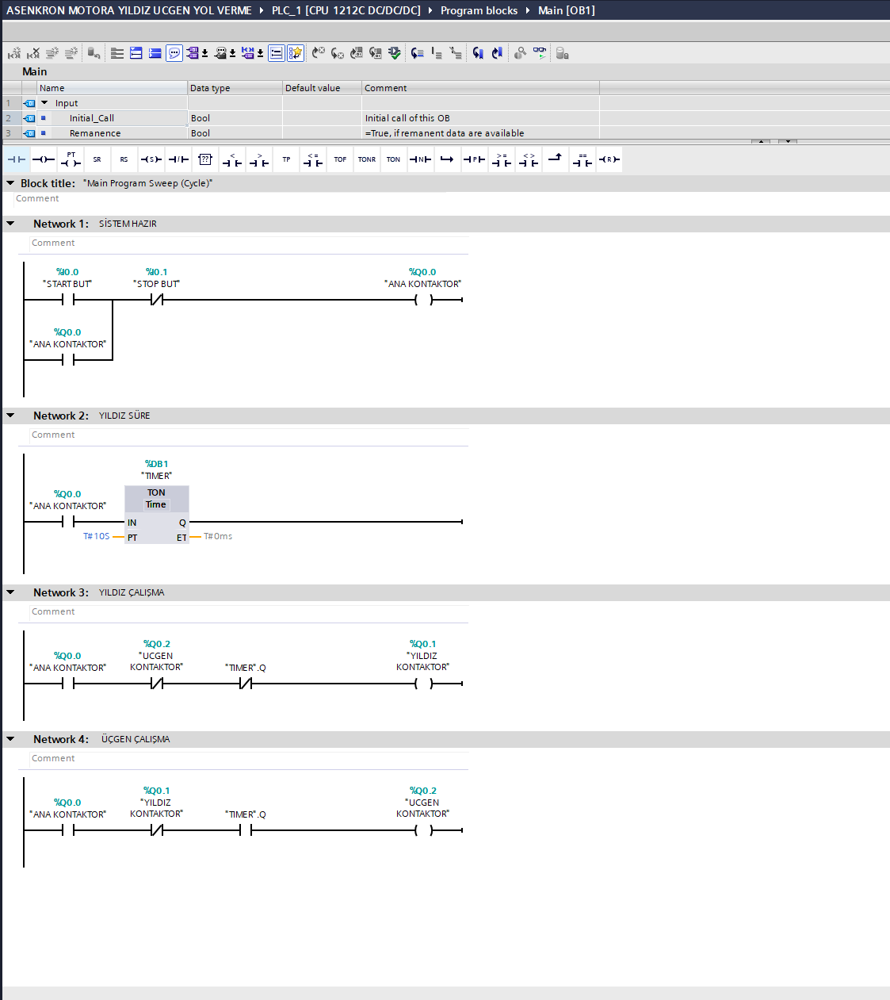

# Asenkron Motor Yıldız-Üçgen Kontrolü

Bu projede Siemens S7-1200 PLC ve TIA Portal V18 kullanılarak üç fazlı asenkron motor için yıldız-üçgen yol verme kontrolü Ladder (LAD) dilinde gerçekleştirilmiştir.

## Kullanılan Teknolojiler

- Siemens S7-1200 PLC
- TIA Portal V18
- Ladder (LAD)

## Program Yapısı

### Network 1 – Sistem Start/Stop
Start butonu ile ana kontaktör devreye alınır. Ana kontaktörün kontağı kullanılarak mühürleme yapılır. Stop butonuna basıldığında sistem durdurulur.

### Network 2 – Yıldız Çalışma Süresi
Ana kontaktör devreye girdiğinde TON zamanlayıcısı çalışmaya başlar. Yıldız çalışma süresi 10 saniye olarak ayarlanmıştır.

### Network 3 – Yıldız Çalışma
Zamanlayıcı süresi tamamlanana kadar yıldız kontaktörü aktif tutulur. Üçgen kontaktörün aynı anda devreye girmesini önlemek için kilitleme kontağı kullanılmıştır.

### Network 4 – Üçgen Çalışma
10 saniyelik süre tamamlandığında yıldız kontaktörü devreden çıkar ve üçgen kontaktörü devreye girer. Yıldız ve üçgen kontaktörlerinin aynı anda aktif olmasını önlemek amacıyla karşılıklı kilitleme uygulanmıştır.

## Proje Dosyası

Repository içerisinde TIA Portal V18 ile oluşturulmuş `.zap18` proje arşivi bulunmaktadır.

## Ladder Diyagramı

Programın Ladder diyagramı aşağıda gösterilmektedir.

